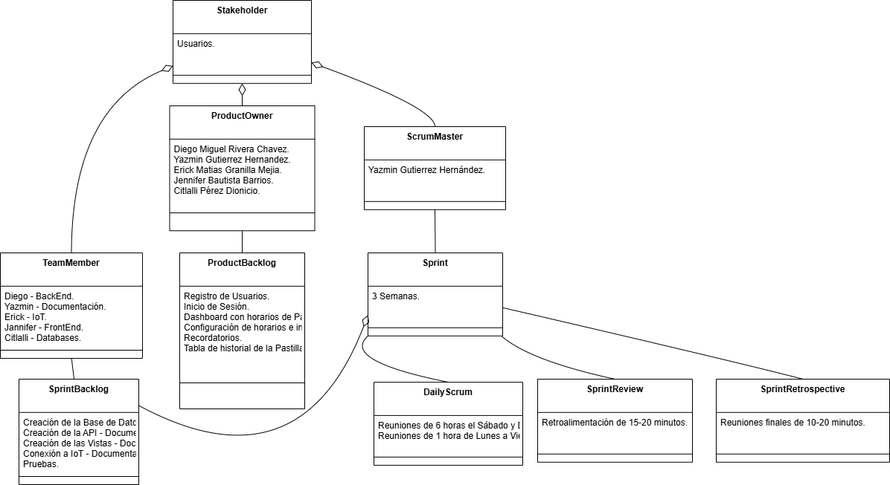

# Diagrams  

En el apartado de **Diagramas** en la documentación del proyecto se incluyen representaciones visuales que ayudan a comprender la arquitectura del sistema, el flujo de trabajo, las relaciones entre los componentes y otros aspectos clave de la solución desarrollada. Estos diagramas proporcionan una visión estructurada y fácilmente comprensible de la solución técnica implementada.

## Tipos de Diagramas incluidos:

1. **Diagrama de Casos de Uso**:
   - Muestra las principales funcionalidades del sistema y cómo interactúan los usuarios con el sistema. Describe cómo los usuarios pueden interactuar con diferentes módulos del proyecto, como el registro, inicio de sesión, creación de contenedores, monitoreo de temperatura/humedad y consulta de registros.
   - Ejemplo de uso: El **usuario** puede registrarse, iniciar sesión, ver los contenedores asignados, y crear registros de datos.

    

2. **Diagrama de Scrum**:
   - Este diagrama muestra cómo se organiza el proyecto utilizando metodologías ágiles como Scrum. Se incluye la división del trabajo en **Sprints**, las **historias de usuario**, las **tareas** y las **responsabilidades** de los miembros del equipo.
   - Ayuda a entender cómo se gestiona el desarrollo y las entregas a lo largo del proyecto.

    

3. **Mapa de Sitio**:
   - El mapa de sitio proporciona una visión de la estructura general del sitio o aplicación, mostrando las diferentes páginas o componentes y cómo están relacionadas entre sí. Este diagrama es útil para entender la jerarquía de las vistas o páginas y cómo navegar a través de ellas.
   - Ejemplo de uso: El **Mapa de Sitio** muestra la relación entre las páginas de **Inicio**, **Usuarios**, **Contenedores**, **Datos de Sensores**, etc.

    

## Estructura de Archivos

>PillBox 
>| - Backend  
>| - Databases 
>&nbsp;&nbsp;|- Backups 
>&nbsp;&nbsp;|- Data Dictionary 
>&nbsp;&nbsp;|- **Diagrams** 
>&nbsp;&nbsp;|- Queries 
>&nbsp;&nbsp;|- Scripts 
>&nbsp;&nbsp;|- Triggers 
>| - Documentation 
>| - FrontEnd 
>| - IoT

## Colaboradores

| Nombre                        | Usuario             | Roles |
|-------------------------------|---------------------|--------|
|  Citlalli Pérez Dionicio |      [KouDionicio](https://github.com/KouDionicio)  |  Base de Datos, Backend      |
|  Diego Miguel Rivera Chavez | [DiegoMiguel04](https://github.com/DiegoMiguel04)       |  Backend, IoT, FrontEnd     |
|  Yazmin Gutierrez Hernandez | [YazUtxj](https://github.com/YazUtxj)            | Documentadora, FrontEnd, Base de Datos   |
|  Erick Matias Granillo Mejia | [Ematias230045](https://github.com/Ematias230045)            | IoT, Backend     |
|  Jennifer Bautista Barrios |[JenniferBautistaBarrios](https://github.com/JenniferBautistaBarrios)            | FrontEnd, Documentadora      |
