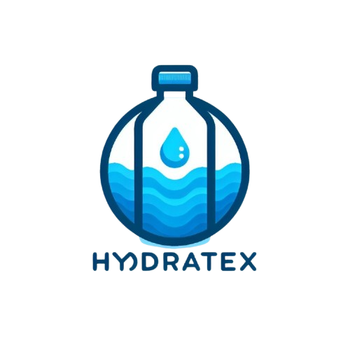

# Proyecto HydrateX

  

## Descripción

HydrateX es un proyecto universitario innovador que busca transformar la forma en que las personas se hidratan. A través del uso de tecnologías de Internet de las Cosas (IoT), el proyecto desarrolla una botella inteligente capaz de conectarse con una plataforma web y una aplicación móvil. Esta conexión permite un monitoreo en tiempo real del consumo de agua y proporciona recomendaciones personalizadas para mejorar hábitos de hidratación.

## ¿Qué es?

HydrateX es una botella inteligente equipada con sensores y conectividad IoT, diseñada para registrar y analizar la ingesta de agua del usuario. Su integración con una aplicación móvil y una plataforma web facilita el acceso a datos e informes personalizados.

## ¿Para qué sirve?

El objetivo de HydrateX es mejorar la salud y el bienestar de los usuarios al ayudarlos a mantener niveles óptimos de hidratación. La botella inteligente alerta cuando es necesario beber agua, ofrece recomendaciones según el estilo de vida y necesidades de cada usuario y contribuye a la adopción de hábitos saludables.

## Problemática

La deshidratación es un problema común que afecta el rendimiento físico y cognitivo de las personas. Muchas personas no consumen la cantidad de agua adecuada debido a la falta de hábito, olvido o falta de información sobre su consumo diario. HydrateX aborda este problema proporcionando una solución tecnológica que ayuda a monitorear y mejorar la ingesta de agua.

## Objetivo General (Solucion)

Desarrollar y comercializar una botella inteligente conectada a una plataforma web y aplicación móvil que permita a los usuarios monitorear y optimizar su consumo de agua de manera eficiente y personalizada.

## Objetivos Específicos

- Diseñar una botella con tecnología IoT capaz de registrar el consumo de agua en tiempo real.

- Desarrollar una aplicación móvil y plataforma web que brinde acceso a datos e informes personalizados.
- Implementar alertas y recomendaciones basadas en los hábitos y necesidades de cada usuario.
- Fomentar la adopción de hábitos saludables de hidratación mediante el uso de tecnología inteligente.
- Evaluar el impacto del uso de la botella en la mejora de la hidratación y bienestar de los usuarios.

## ¿A qué público va dirigido?

HydrateX está dirigido a:

- Personas con un estilo de vida activo que desean mejorar su hidratación.
- Deportistas y atletas que buscan un monitoreo preciso de su consumo de agua.
- Profesionales y estudiantes con jornadas largas que necesitan recordatorios de hidratación.
- Adultos mayores o personas con condiciones médicas que requieren un control más estricto de su ingesta de líquidos.
## Colaboradoes

| Nombre                        | Usuario             | Roles |
|-------------------------------|---------------------|--------|
| Yazmin Gutierrez Hernandez  | [YazUtxj](https://github.com/YazUtxj)        | Documentador , FronEnd,  Base de Datos       |
| Diego Miguel Rivera Chavez          | [DiegoMiguel04](https://github.com/DiegoMiguel04)       |  Backend, Iot , FronEnd     |
| Citlalli Dionicio Cabrera   | [KouDionicio](https://github.com/KouDionicio)             |  Base de Datos ,Backend     |
|  Erick Matias Granillo Mejia           | [Ematias230045](https://github.com/Ematias230045)            | Iot ,Backend     |
| Jennifer Bautista Barrios           |[JenniferBautistaBarrios](https://github.com/JenniferBautistaBarrios)            | FronEnd , Documentador      |

