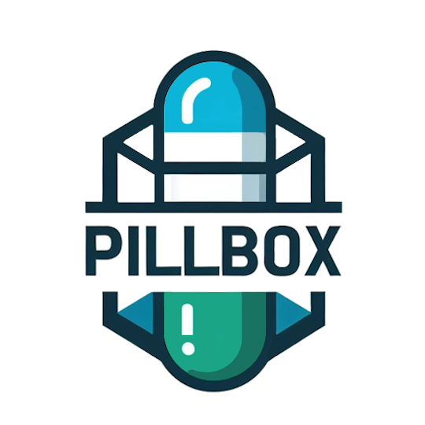

# Proyecto PillBox
<table>
   <td>Logo de la Aplicacion</td>
   <td>Logo de empresa</td>
  <tr>
    <td>    </td>
    <td>    </td> 
  </tr>
</table>

## ¿Qué es?

PillBox es un pastillero inteligente  integrado a una botella con tecnología IoT diseñado para ayudar a las personas a gestionar su medicación de manera eficiente. Está equipado con sensores y conectividad que permiten registrar y controlar la administración de medicamentos. Su integración con una aplicación móvil y una plataforma web facilita el acceso a datos en tiempo real, recordatorios y alertas personalizadas para mejorar la adherencia al tratamiento.

## ¿Para qué sirve?

PillBox tiene como objetivo mejorar la salud y calidad de vida de los usuarios al garantizar que tomen sus medicamentos en el momento adecuado. Proporciona alertas visuales y sonoras para recordar la ingesta de medicamentos, permite a los cuidadores y familiares monitorear el cumplimiento del tratamiento y ofrece información detallada sobre el consumo de medicamentos a través de la aplicación móvil y la plataforma web.

## Problemática

Muchas personas olvidan tomar sus medicamentos o tienen dificultades para organizar su tratamiento, lo que puede afectar negativamente su salud y reducir la efectividad del mismo. Este problema es especialmente crítico en adultos mayores y pacientes con enfermedades crónicas, quienes requieren un control preciso de su medicación. PillBox aborda esta problemática ofreciendo una solución tecnológica que facilita el monitoreo y la adherencia al tratamiento mediante recordatorios inteligentes, alertas y acceso remoto para cuidadores y familiares.

## Objetivo General (Solucion)

Desarrollar un prototipo de pastillero integrado a una botella y vinculado a una aplicación multiplataforma que enviara alertas visuales y sonoras, con la finalidad de mejorar la accesibilidad al medicamento y que a su vez sirva como ayuda para recordar los horarios de acuerdo con el tratamiento médico.

## Objetivos Específicos

- Analizar y definir los elementos de hardware y software para la elaboración del proyecto.
-	Realizar el diseño del prototipo del proyecto.
-	Realizar la maquetación de la estructura del proyecto.
-	Realizar el desarrollo de software del proyecto.
-	Realizar y vincular la base de datos del proyecto.
-	Realizar pruebas de funcionalidad del proyecto y documentarlas de ser necesario.
-	Implementar mejoras al proyecto en caso de ser necesario.

## ¿A qué público va dirigido?

HydrateX está dirigido a:

-	Personas mayores que requieren apoyo para la administración de sus medicamentos sin depender de aplicaciones complejas.
- Pacientes con enfermedades crónicas (diabetes, hipertensión, etc.) que necesitan un control preciso de su medicación.
-	Cuidadores y familiares que desean monitorear a distancia el cumplimiento del tratamiento de sus seres queridos.
-	Personas en general que desean mejorar el seguimiento y la adherencia a sus tratamientos médicos, asegurando una correcta administración de medicamentos.

## Colaboradoes

| Nombre                        | Usuario             | Roles |
|-------------------------------|---------------------|--------|
| Yazmin Gutierrez Hernandez  | [YazUtxj](https://github.com/YazUtxj)        | Documentador , FronEnd,  Base de Datos       |
| Diego Miguel Rivera Chavez          | [DiegoMiguel04](https://github.com/DiegoMiguel04)       |  Backend, Iot , FronEnd     |
| Citlalli Dionicio Cabrera   | [KouDionicio](https://github.com/KouDionicio)             |  Base de Datos ,Backend     |
|  Erick Matias Granillo Mejia           | [Ematias230045](https://github.com/Ematias230045)            | Iot ,Backend     |
| Jennifer Bautista Barrios           |[JenniferBautistaBarrios](https://github.com/JenniferBautistaBarrios)            | FronEnd , Documentador      |

